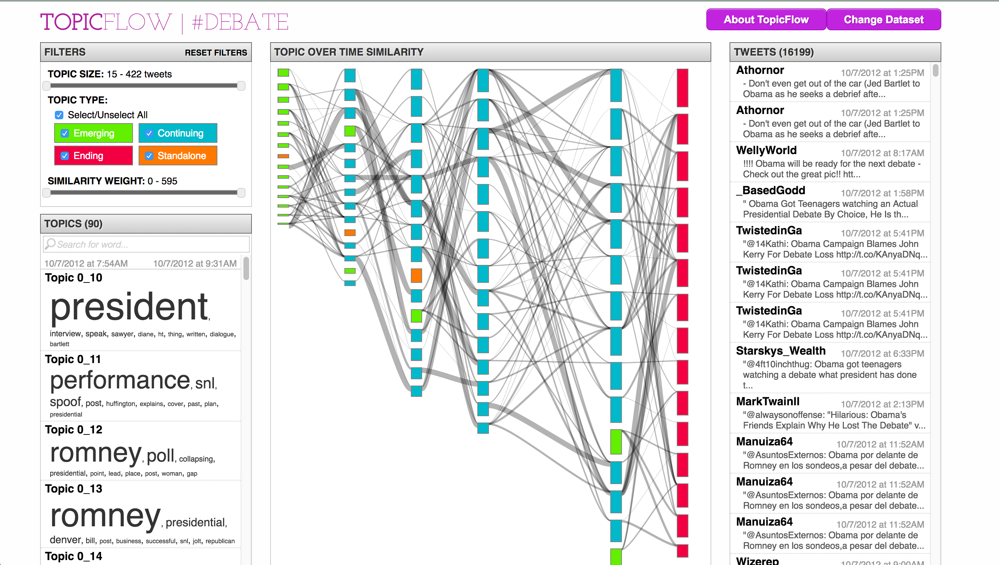

# TopicFlow

This is a fork from the TopicFlow project by Smith et al [1].

The original Github project includes all the necessary code to display visualization for data contained within each [data](https://github.com/sailuh/topicflow/tree/master/data) folder project. The scripts required to generate said data in the original Github project, however, do not seem to be available.

This fork is a work-in-progress to create the data scripts pipeline to reuse TopicFlow for any other corpus besides Tweets.

This version of TopicFlow can be utilized to visualize Full Disclosure or Bugtraq datasets for [PERCEIVE](https://github.com/sailuh/perceive). A detailed notebook of how the data transformation pipeline works can be found in [Data Transformation Pipeline for Full Disclosure- a Notebook](https://github.com/estepona/topicflow/blob/2-data-transformation-pipeline-for-full-disclosure/Data%20Transformation%20Pipeline%20for%20Full%20Disclosure-%20a%20Notebook.ipynb).

## Usage

Git clone this project, and from the main directory, issue the following command:

`python run.py -h`

You will see the detailed usage of TopicFlow. To see the existing visualizations, simple issue `python run.py`, and open a local server with the specified port number printed in the terminal.

**Please note that this transformation pipeline only works for Full Disclosure data**
The functions in this pipeline only works for Full Disclosure datasets. To create a new project, the two specified directories after "-a" must contain the following files or sub-directories:

*path_doc*  
&nbsp;&nbsp;&nbsp;&nbsp; |- yyyy_mm_index.txt  
&nbsp;&nbsp;&nbsp;&nbsp; |- Full_Disclosure_Mailing_List_mmyyyy.csv  

*path_LDA*  
&nbsp;&nbsp;&nbsp;&nbsp; |- Document_Topic_Matrix  
&nbsp;&nbsp;&nbsp;&nbsp; |- Topic_Flow  
&nbsp;&nbsp;&nbsp;&nbsp; |- Topic_Term_Matrix  

An example command to create a new project called "Fre" is:

`python topicflow\run.py -n "Fre" -a "E:\documents\Learning Materials\from_UMD\projects\PERCEIVE\data\Full Disclosu re\2012 - Copy" "E:\documents\Learning Materials\from_UMD\projects\PERCEIVE\data\LDA_VEM\2012_k_10_12"`

Notice that this program requires python3 environment. A detailed notebook of how the data transformation pipeline works can be found in `Data Transformation Pipeline for Full Disclosure- a Notebook`.

## Data Model

Please see the `data_model` folder in this repo. The editable files for the images are in XML and can be imported on [Draw.io](http://draw.io) to be edited.

## References

[1] Smith, Alison, Malik, Sana and Shneiderman, Ben. "Visual Analysis of Topical Evolution in Unstructured Text: Design and Evaluation of TopicFlow.." In Applications of Social Media and Social Network Analysis, edited by Przemyslaw Kazienko and Nitesh V. Chawla, 159-175. : Springer, 2015.
